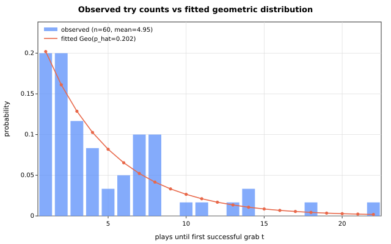
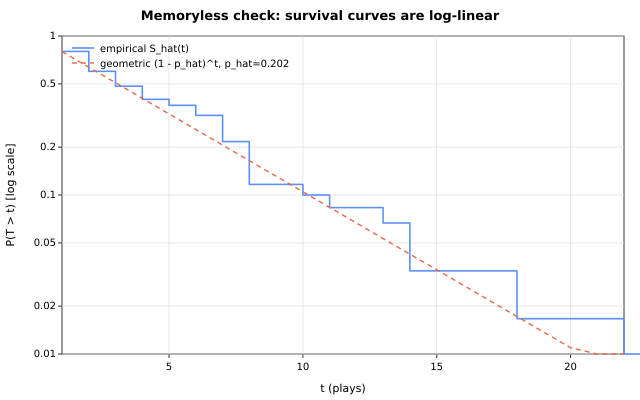
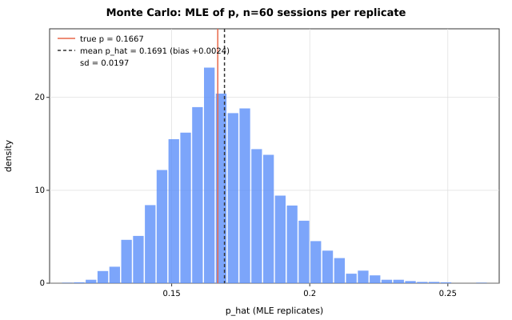

# Ben & Jerry's Claw Machine at UTown — a geometric analysis

Modelling the expected number of \$1 plays before successfully grabbing a
~\$6 tub from the Ben & Jerry's ice-cream claw machine: choosing the right
distribution, deriving the estimator, and checking whether the game is
worth playing.

> **TL;DR** — Each play is an independent Bernoulli trial with success
> probability $p$ (the machine's effective grab probability).  The number
> of plays until the first successful grab, $T$, follows a **geometric
> distribution** $\mathrm{Geo}(p)$, $\mathbb{E}[T] = 1/p$, so the expected
> spend is \$1 per play × $1/p$.  The **maximum-likelihood estimate** of
> $p$ from session data is simply
>
> $$ \hat p = \frac{\text{number of successful grabs}}{\text{total number of plays}}, $$
>
> which for sessions that always end in a grab reduces to
> $\hat p = 1/\bar t$ (reciprocal of the average number of tries).
> The game **breaks even in expectation** when $p = 1/6 \approx 0.167$,
> i.e. one successful grab every six plays on average.  On the simulated
> example data the estimate is $\hat p = 0.202$ with a 95% Wilson CI of
> $[0.160,\ 0.251]$ — consistent with the break-even value (binomial test
> vs $p^{*}=1/6$: $p = 0.10$).

---

## Contents

| Path | What it is |
|---|---|
| [`docs/DERIVATION.md`](docs/DERIVATION.md) | Full derivation: geometric model, MLE, Fisher information, Wilson CI, decision analysis, model checks |
| [`docs/DATA_COLLECTION.md`](docs/DATA_COLLECTION.md) | Protocol for collecting *real* observations (session definition, censoring, sample size) |
| [`analysis/fit_geometric.py`](analysis/fit_geometric.py) | Core functions: MLE, Wilson CI, chi-square goodness-of-fit |
| [`analysis/analyze.py`](analysis/analyze.py) | CLI: load data → fit → report → figures |
| [`analysis/simulate.py`](analysis/simulate.py) | Reproducible example data + Monte-Carlo validation of the estimator |
| [`data/example_observations.csv`](data/example_observations.csv) | Simulated example data (60 sessions) — *not* observed |
| [`tests/`](tests) | Unit tests (`python -m pytest -q`) |
| [`.github/workflows/ci.yml`](.github/workflows/ci.yml) | CI: runs tests + end-to-end pipeline on every push |

## The model

Each play is a Bernoulli trial with success probability $p$.  Let $T$ be
the number of plays needed until (and including) the first successful
grab.  If trials are independent and $p$ is constant:

$$
P(T = t) = (1-p)^{t-1} p, \qquad t = 1, 2, 3, \dots
\qquad \mathbb{E}[T] = \frac{1}{p}.
$$

The geometric distribution is the discrete analogue of the exponential and
is the *only* discrete distribution with the **memoryless property** — the
natural baseline for a machine whose per-play behaviour is constant.  (If
the claw gets stronger after every failure, $p$ is not constant; see
[model checks](docs/DERIVATION.md#5-model-checks).)

Alternatives and why they don't fit this question: the **binomial** models
wins in a *fixed* number of plays (here the stopping time is random); the
**negative binomial** models tries until the $r$-th win (the geometric is
its $r=1$ case — use it if you play until you collect several tubs); the
**Poisson** models events in a fixed time window, not trials-until-success.

## Estimating $p$ from data

With $n$ sessions that each end in a grab after $t_i$ plays, the MLE is

$$
\hat p_{\mathrm{MLE}} = \frac{n}{\sum_i t_i} = \frac{1}{\bar t}.
$$

If some sessions are right-censored (the player gives up after $u_j$
failed plays), the censored likelihood gives the same recipe in disguise:

$$
\hat p_{\mathrm{MLE}} = \frac{\text{grabs}}{\sum_i t_i + \sum_j u_j}
= \frac{\text{successful grabs}}{\text{total plays}}.
$$

The standard error is $\mathrm{SE}(\hat p) = \sqrt{\hat p(1-\hat p)/N}$
(binomial view, $N$ = total plays) and confidence intervals use the
**Wilson score interval**, which behaves better than the Wald interval for
small samples.  See [`docs/DERIVATION.md`](docs/DERIVATION.md) for the
full derivation.

## Is it worth it? (decision analysis)

At \$1 per play and a ~\$6 tub, the expected spend per successful grab is
$1/\hat p$, and the **break-even win probability** is $p^{*} = 1/6$.  The
probability of grabbing within $k$ plays is $1 - (1-\hat p)^k$:

| $k$ plays | $P(\text{grab within } k)$ at $\hat p = 0.202$ |
|---|---|
| 3 | 49% |
| 6 | 74% |
| 10 | 90% |
| 12 | 93% |

On the example data, expected spend ($\$4.95$) is *below* the tub price —
but the difference is not statistically significant (95% CI for $p$
contains $1/6$; binomial test $p = 0.10$).

## Example results (simulated data)

The shipped example data is **simulated** (the author could not operate the
physical machine) from $\mathrm{Geo}(p=1/6)$ with a fixed seed — see
[`analysis/simulate.py`](analysis/simulate.py).  All numbers below are
therefore a reproducible illustration of the pipeline, not an observation.
Drop real data into `data/observations.csv` and re-run to get the real
answer.

```
60 sessions, 297 total plays, mean tries to success = 4.95

p_hat        = 60/297 = 0.20202
SE           = 0.02330
95% Wilson CI = [0.16029, 0.25136]
expected tries = 4.95 plays, expected spend = $4.95
break-even p*  = 0.16667   (binomial test vs p*: p = 0.1024)
goodness of fit (chi-square, df = 3): chi2 = 0.851, p = 0.837
```





Monte-Carlo validation of the estimator (5000 replicates, 60 sessions
each, true $p = 1/6$): mean $\hat p = 0.1691$ (bias +0.0024), SD 0.0197,
95% CI coverage 0.952 — the estimator is nearly unbiased with correct
coverage.



## Reproducing

```bash
pip install -r requirements.txt

# 1. regenerate the example data (60 sessions, seed 42)
python analysis/simulate.py --p 0.1667 --n 60 --seed 42 --out data/example_observations.csv

# 2. Monte-Carlo validation of the estimator
python analysis/simulate.py --monte-carlo --p 0.1667 --n 60 --reps 5000 --seed 7 --figures figures

# 3. fit the model and produce the report + figures
python analysis/analyze.py --data data/example_observations.csv --figures figures --results results

# 4. run the tests
python -m pytest -q
```

## Limitations & extensions

* **Constant $p$ assumption.**  Claw machines often increase claw strength
  after failed attempts or force payouts periodically; the survival-curve
  diagnostic shows curvature on the log scale when this happens.  The MLE
  $\hat p$ is then still a sensible *average* win rate, but the
  distribution of try counts is not geometric — a discrete hazard / time-
  varying-$p$ model is the extension.
* **Small samples.**  With ~300–600 total plays the 95% CI narrows to
  ±0.03–0.04, enough to distinguish $p = 0.13$ from the break-even
  $1/6$.  See [`docs/DATA_COLLECTION.md`](docs/DATA_COLLECTION.md).
* **Machine settings drift.**  Operators change claw strength and repack
  the tubs; treat the estimate as valid for the observation window.

## License

MIT — see [LICENSE](LICENSE).
